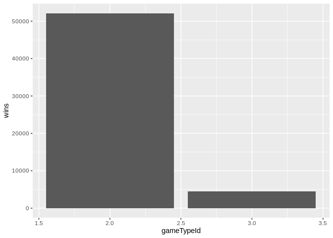
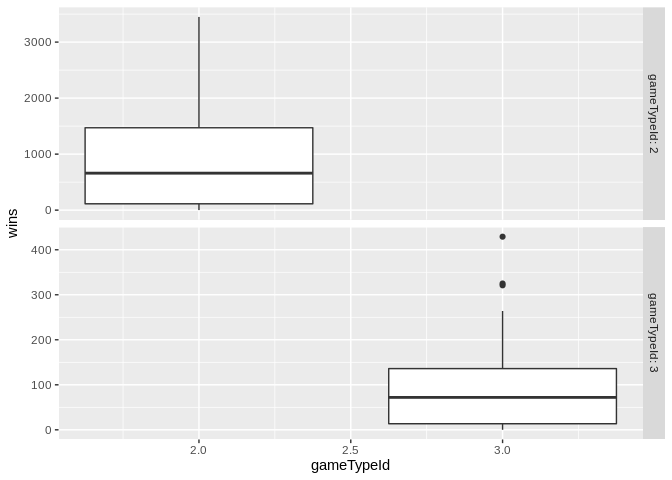

Project 1: Vignettes about Reading JSON Files and analysis in R
================
Min He
June 9, 2020 (updated 2020-06-10)

# JSON Description

JSON (JavaScript Object Notation) is a lightweight data-interchange
format. It is easy for humans to read and write. It is easy for machines
to parse and generate. JSON is common data formats used to receive data
from a web server. JSON is built on two structures: 1. A collection of
name/value pairs. 2. An ordered list of values.

# Pros/Cons of Packages

We chose the `jsonlite` package to read in our data \[@jsonlite\]. The
`rjson` package was also considered, but inital attempts performed
slowly and needed extra code to implement the data into a dataframe
\[@rjson\]. The `jsonlite` package converts read data directly into a
dataframes by default, while `rjson` will convert data into a list by
default. Given our need to work with large data sets and to create
dataframes, `jsonlite` performs better for our needs.

# Data

This data we are using is the NHL records, an jsonlite API is used to
retrieve all the team data (including the details about team New Jersey
Devils).

## Read the data

``` r
# Read in data from JSON source

root_url <- 'https://records.nhl.com/site/api'
json_file <- (paste0(root_url,'/franchise'))
source_data <- fromJSON(json_file)
franchise_df <- as.data.frame(source_data$data) #Convert to data frame

json_file <- (paste0(root_url,'/franchise-team-totals'))
source_data <- fromJSON(json_file)
franchise_team_total <- as.data.frame(source_data$data) #Convert to data frame
franchise_team_total$gameTypeId <- as.factor(franchise_team_total$gameTypeId)


franchise_id=23
json_file <- (paste0(root_url,'/franchise-season-records?cayenneExp=franchiseId=',franchise_id))
source_data <- fromJSON(json_file)
franchise_team_season <- as.data.frame(source_data$data) #Convert to data frame


json_file <- (paste0(root_url,'/franchise-goalie-records?cayenneExp=franchiseId=',franchise_id))
source_data <- fromJSON(json_file)
franchise_team_goalie <- as.data.frame(source_data$data) #Convert to data frame

json_file <- (paste0(root_url,'/franchise-skater-records?cayenneExp=franchiseId=',franchise_id))
source_data <- fromJSON(json_file)
franchise_team_skater <- as.data.frame(source_data$data) #Convert to data frame
```

## Basic data exploratory

A basic exploratory data analysis. + The scatterplot between losses and
home losses shows a very good linear relationship + The linear
relationship between losses and home losses still hold within each game
type.

``` r
ggplot(franchise_team_total,aes(losses,homeLosses)) +
  geom_point()
```

<!-- -->

``` r
ggplot(franchise_team_total,aes(losses,homeLosses)) +
  geom_point() +
  facet_grid(cols=vars(gameTypeId),scales = "free",labeller = label_both)
```

<!-- -->

**Take the** *franchiseId=23* **an an example, the scatterplot between
most wins in one season and total wins for each team member shows some
linear relationship and this relationship is better when the outlier was
excluded.**

``` r
plot(franchise_team_goalie$mostWinsOneSeason, franchise_team_goalie$wins, main='Relationshio between most wins in one season\n v.s. wins for each member')
```

<!-- -->

``` r
plot(franchise_team_goalie$mostWinsOneSeason[-1], franchise_team_goalie$wins[-1], main='Relationshio between most wins in one season\n v.s. wins for each member (exclude outlier)')
```

<!-- -->

## Create Contingency Table

**Show contingency table with columns of team and game type (summarise
the total of wins)**

``` r
#Function creates Contingency Table
contingencyTable<-franchise_team_total %>% group_by_at(c('teamName','gameTypeId')) %>% 
    summarise(wins = sum(wins)) %>% 
    spread(key = 'gameTypeId', value = "wins")

kable(contingencyTable)
```

| teamName                    |       2 |                                                                                          3 |
| :-------------------------- | ------: | -----------------------------------------------------------------------------------------: |
| Anaheim Ducks               |     973 |                                                                                         89 |
| Arizona Coyotes             |     190 |                                                                                         NA |
| Atlanta Flames              |     268 |                                                                                          2 |
| Atlanta Thrashers           |     342 |                                                                                          0 |
| Boston Bruins               |    3208 |                                                                                        321 |
| Brooklyn Americans          |      16 |                                                                                         NA |
| Buffalo Sabres              |    1790 |                                                                                        124 |
| Calgary Flames              |    1471 |                                                                                         98 |
| California Golden Seals     |     116 |                                                                                         NA |
| Carolina Hurricanes         |     791 |                                                                                         49 |
| Chicago Blackhawks          |    2788 |                                                                                        264 |
| Cleveland Barons            |      47 |                                                                                         NA |
| Colorado Avalanche          |     968 |                                                                                        109 |
| Colorado Rockies            |     113 |                                                                                          0 |
| Columbus Blue Jackets       |     660 |                                                                                         11 |
| Dallas Stars                |    1061 |                                                                                         90 |
| Detroit Cougars             |      64 |                                                                                          0 |
| Detroit Falcons             |      34 |                                                                                          0 |
| Detroit Red Wings           |    2872 |                                                                                        325 |
| Edmonton Oilers             |    1434 |                                                                                        159 |
| Florida Panthers            |     852 |                                                                                         18 |
| Hamilton Tigers             |      47 |                                                                                         NA |
| Hartford Whalers            |     534 |                                                                                         18 |
| Kansas City Scouts          |      27 |                                                                                         NA |
| Los Angeles Kings           |    1733 |                                                                                        111 |
| Minnesota North Stars       |     758 |                                                                                         80 |
| Minnesota Wild              |     724 |                                                                                         26 |
| Montréal Canadiens          |    3449 |                                                                                        429 |
| Montreal Maroons            |     271 |                                                                                         20 |
| Montreal Wanderers          |       1 |                                                                                         NA |
| Nashville Predators         |     821 |                                                                                         51 |
| New Jersey Devils           |    1375 |                                                                                        137 |
| New York Americans          |     239 |                                                                                          6 |
| New York Islanders          |    1656 |                                                                                        148 |
| New York Rangers            |    2856 |                                                                                        244 |
| Oakland Seals               |      66 |                                                                                          3 |
| Ottawa Senators             |     948 |                                                                                         72 |
| Ottawa Senators (1917)      |     258 |                                                                                         18 |
| Philadelphia Flyers         |    2054 |                                                                                        221 |
| Philadelphia Quakers        |       4 |                                                                                         NA |
| Phoenix Coyotes             |     615 |                                                                                         22 |
| Pittsburgh Penguins         |    1866 |                                                                                        206 |
| Pittsburgh Pirates          |      67 |                                                                                          1 |
| Quebec Bulldogs             |       4 |                                                                                         NA |
| Quebec Nordiques            |     497 |                                                                                         35 |
| San Jose Sharks             |    1049 |                                                                                        119 |
| St. Louis Blues             |    1902 |                                                                                        180 |
| St. Louis Eagles            |      11 |                                                                                         NA |
| Tampa Bay Lightning         |     949 |                                                                                         73 |
| Toronto Arenas              |      18 |                                                                                          4 |
| Toronto Maple Leafs         |    2838 |                                                                                        254 |
| Toronto St. Patricks        |     109 |                                                                                          4 |
| Vancouver Canucks           |    1626 |                                                                                        101 |
| Vegas Golden Knights        |     133 |                                                                                         16 |
| Washington Capitals         |    1664 |                                                                                        135 |
| Winnipeg Jets               |     352 |                                                                                         11 |
| Winnipeg Jets (1979)        |     506 |                                                                                         19 |
| \# Plotting                 |         |                                                                                            |
| \#\# Scatter plot by color  |         |                                                                                            |
| \*\*Scatterplot between the | loss an | d home loss with colored by game type, the results show very good linear relationship.\*\* |

``` r
ggplot(franchise_team_total,aes(losses,homeLosses, color=gameTypeId)) +
  geom_point() 
```

<!-- -->

## Histogram plot by side by side

**Plot the histogram of the wins by game
type**

``` r
franchise_by_gametype<-franchise_team_total %>% group_by_at(c('teamName','teamId','gameTypeId')) %>% 
    summarise(wins = sum(wins), losses=sum(losses))

ggplot(franchise_by_gametype,aes(gameTypeId,wins)) +
  geom_col() 
```

<!-- -->

**Plot the histogram of the wins for each team (side by side with game
type)**, *It shows that when the wins in game type=2 is high, the wins
in game type=2 is also high.*

``` r
ggplot(franchise_by_gametype,aes(teamId,wins,gameTypeId)) +
  geom_col() +
  facet_grid(rows=vars(gameTypeId), labeller = label_both,scales = "free",)
```

<!-- -->

## Box plot side by side

**The box plot for wins within the game type.** + We can see that the
median for the game type=2 is around 650 with no outliers + The median
for the game type=3 is around 70 with two outliers

``` r
ggplot(franchise_team_total,aes(gameTypeId,wins)) +
  geom_boxplot() +
  facet_grid(rows=vars(gameTypeId), labeller = label_both,scales = "free" )
```

<!-- -->

# Create new variables

**Create new variable** + Over all win percent (winPercent) + Win
percent at home (homewinPercent) + Scatter plot the win percent v.s.
home win percent, the result shows strong linear relationship with more
outliers than the scatter plot of wins v.s. homewins.

``` r
#Create new variables of home win percentage and win percentage
franchise_team_percentage<-franchise_team_total %>% replace_na(list(wins= 0, ties = 0, losses=0, homeWins=0, homeLosses=0, homeTies=0)) %>%
  mutate(winPercent=wins/(wins+ties+losses),homewinPercent=homeWins/(homeWins+homeTies+homeLosses)) 

ggplot(data=franchise_team_percentage,aes(winPercent,homewinPercent)) +
  geom_point()
```

<!-- -->
